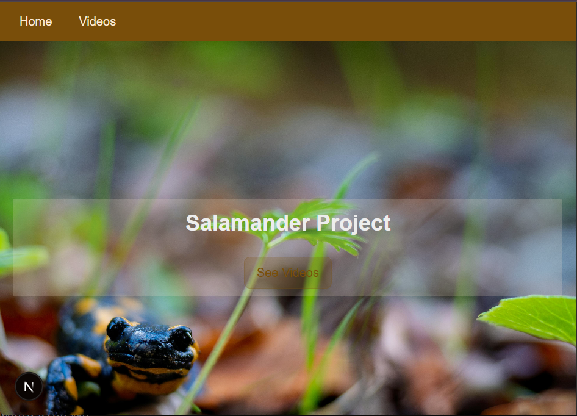
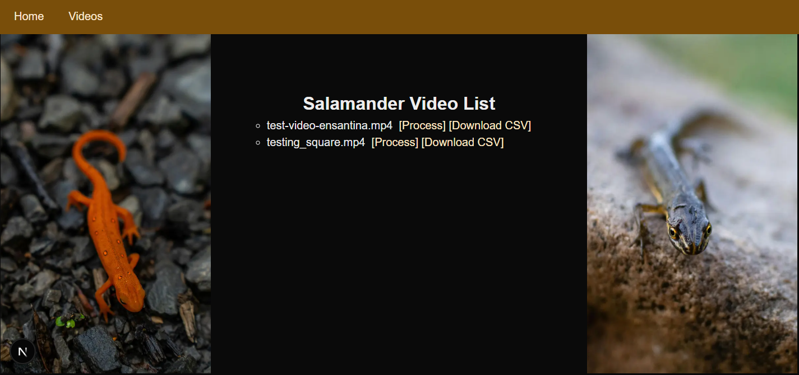
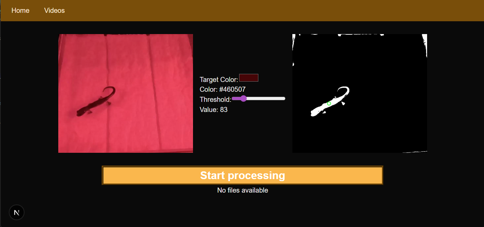
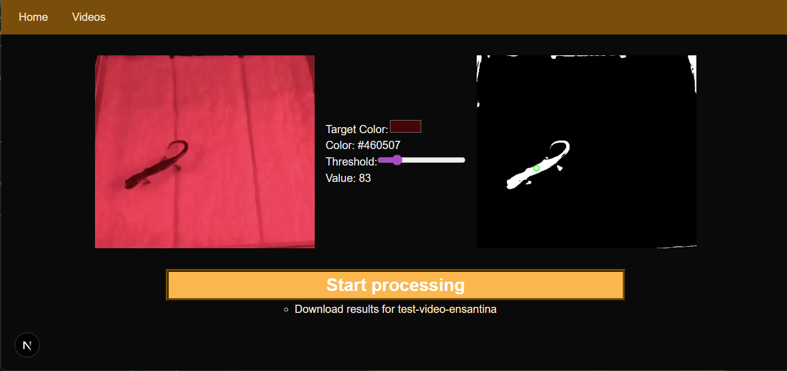

# Salamander Tracker

## Project Overview
Salamander tracker is a front-end UI for interfacing with the Salmander tracker back-end api hosted in a Docker container. The project uses color-based image binarization to track the largest object of a specific color through video frames and returns the results as a CSV file. 

The front-end can generate and adjust a black-and-white preview image from the video thumbnail so the user can dial in the right color (via the HTML color picker) and threshold (using the slider). It also displays the server’s job status in real time and provides download links for the CSV output stored on the host.

## Directory Structure
    /app
        /videos       – List of videos & their statuses
            /preview  – Image previews, color picker, processing UI
    /components       – UI components (status display, buttons, etc.)
    /mock             - mock data for testing purposes
    /lib              – API helpers, polling logic, shared functions
    /public           – Static assets

## Set Up Instructions

### Required Programs
- Docker
- A working web browser
- PC's Command line

### Set Up
Have Docker running and use the DockerImage from [GitHub](https://github.com/users/AAshGray/packages/container/package/salamander) or the one from the [Centroid-Finder Project](https://github.com/Gabby-Moon/centroid-finder) to build and run the container using port 3000 and mounting two volumes (pathways) for a results and videos folder  
For right now, make sure to download the current repo for the front-end to have it work on your local machine.  
Make sure to install all the dependencies for the ```run dev``` script works. Then put in ```run dev``` in the terminal from the folder location of the program.  
Lastly, go into your web browser and type in ```http://localhost:3001``` or click [here](http://localhost:3001).  
Congratulations! The page is set up for you to use!

## How To Use
  
On the starting page you can click the ```See Videos``` button to see a list of videos and ```[Process]``` text next to each, clicking on it will take you to the processing page for that video.  

If you already had processed a video you will see ```Download CSV``` text that will let you download the latest processed version.  

On the process page you will see two images, one from the video and the other a binarized version of that image with the given color and threshold. You can click on the color box to input a color or use the eyedropper to color pick from the first photo. There is also a threshold slider, making it larger will give more room for like colors to be found, and smaller will do the opposite.  
Once you are satisfied, you can press the button labeled ```Start Processing```. Once clicked it will show you the status of that video, and when it's done, will give you the option to download the ```.csv``` file that has been made.  

Under the ```Start Processing``` button is either text saying ```No files available``` or, if a video has been processed on that page, the download link.  
The nav bar at the top can take you back to either the home or video page.

## Known Issues/Limitations
* Processing only works if backend container is running
* Videos must exist in the mounted /videos volume
* CSV overwrites previous output for the same video

### Modifying for Development/Other Projects
Fetch requests expect the API server to be hosted at http://localhost:3000 and for the videos, results, and thumbnails to be hosted statically on the server in /videos and /results. 

#### Expected endpoints
If you run the backend container on a different port or host, update the `serverURL` constant in the lib/fetch.js helper file.

The UI expects these endpoints to exist:

| Purpose                 | Method | Endpoint                                             | Notes                                                         |
|-------------------------|--------|------------------------------------------------------|---------------------------------------------------------------|
| List all videos         | GET    | `/api/videos`                                        | Returns JSON with an array of video names.               |
| Get a thumbnail image   | GET    | `/thumbnail/:filename`                               | Returns a jpeg thumbnail for the selected video.                           |
| Start processing video  | POST   | `/process/:filename?targetColor=...&threshold=...`   | Starts processing and returns a job ID.                      |
| Check job status        | GET    | `/process/:jobId/status`                             | Returns JSON job status (`processing` or `done` + `csv link`).    |
| Check CSV availability  | HEAD   | `/results/:filename`                                 | Used to determine if the output CSV file exists.             |

The front-end relies on these routes being available at these exact paths. If you're using a different backend or setup, make sure to provide routes with the same structure or update the API helper file as needed.